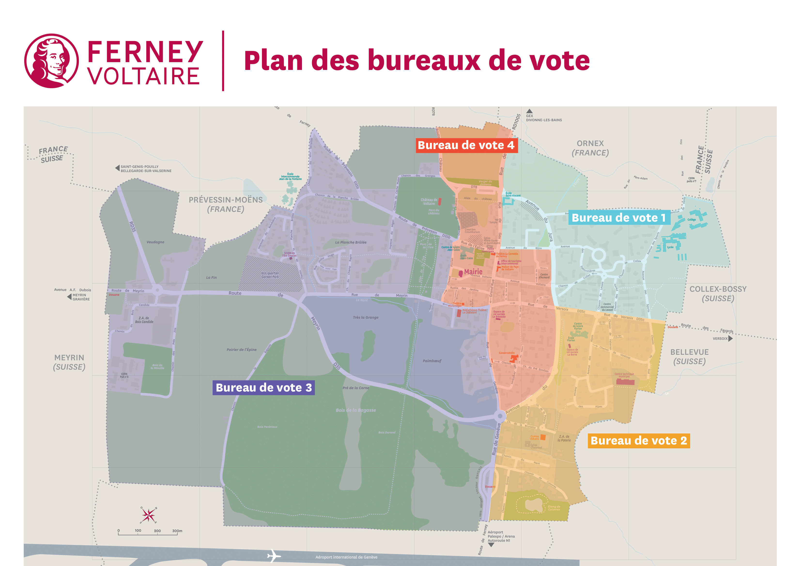
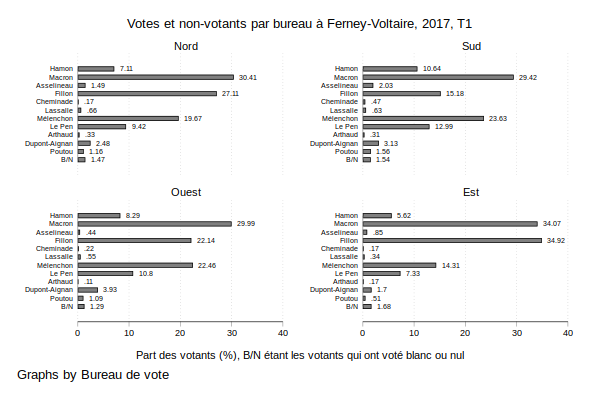

---
# Course title, summary, and position.
linktitle: Quelques informations sur Ferney-Voltaire
title: 
toc: false
summary: Petite analyse sur les élections présidentielles de 2017 et 2022.
weight: 1

# Page metadata.
# title: The Template
# date: "2018-09-09T00:00:00Z"
# lastmod: "2018-09-09T00:00:00Z"
# draft: false  # Is this a draft? true/false
# toc: false  # Show table of contents? true/false
# type: docs  # Do not modify.

# Add menu entry to sidebar.
# - name: Declare this menu item as a parent with ID `name`.
# - weight: Position of link in menu.
# menu:
#  example:
#    name: The template TEST
#    weight: 1
---

# Élections présidentielles à Ferney-Voltaire

Remarque préliminaire : les données électorales, sauf mention du contraire, sont tirées des sources officielles.[^1] 

## Quatre bureaux de vote et une baisse de la proportion d'inscrits

| Bureau de vote | 2017   | 2022   |
| -------------- | ------ | ------ |
| Nord           | 757    | 730    |
| Sud            | 811    | 944    |
| Ouest          | 913    | 1092   |
| Est            | 1148   | 1222   |
| *Total*        | *3629* | *3988* |

En 2018, l'INSEE recensait 9895 habitants[^2]. La croissance démographique annuelle est de 2.7%. Le tableau sur les effectifs par bureau de vote indique qu'il y a eu une croissance moyenne annuelle des inscrits sur les listes électorales de 1.9%,[^3] soit une progression plus faible que la progression démographique. Les bureaux de vote du sud et de l'ouest ont le plus gagné en inscrits sur la période (croissance annuelle de plus de 3%). Il n'en demeure pas moins que le ratio inscrits sur population décroît avec le temps.

Plusieurs facteurs peuvent expliquer cela : (i) un rajeunissement de la population, (ii) une part d'étranger plus importante, (iii) une part de migrants internes qui ne s'inscrivent pas sur les listes électorales de leur nouvelle résidence, (iv) une plus faible proportion de personnes nouvellement arrivées à l'âge légal pour voter qui s'inscrit sur les listes électorales. Si ce n'est pas évident de séparer les différentes raisons, il reste clair que la baisse de la part de la population inscrite sur les listes électorales est un sujet important est potentiellement problématique. Il est notable que la part d'inscrit sur les listes électorales dans la population totale de la ville est inférieure à 40% alors qu'elle dépasse les 70% à l'échelle du pays.[^4]

<!--

-->
<!--
[//]: # 

[//]: # <iframe width="600" height="400" frameborder="0" scrolling="no" marginheight="0" marginwidth="0" sandbox="allow-forms allow-scripts allow-same-origin" src="https://www.geoportail.gouv.fr/embed/visu.html?c=6.1115935837128434,46.256864425173575&z=15&l0=GEOGRAPHICALGRIDSYSTEMS.MAPS.SCAN25TOUR::GEOPORTAIL:OGC:WMTS(1)&l1=LIMITES_ADMINISTRATIVES_EXPRESS.LATEST::GEOPORTAIL:OGC:WMTS(1)&l2=INSEE.FILOSOFI.NIVEAU.DE.VIE.SECRET::GEOPORTAIL:OGC:WMTS(0.8)&permalink=yes" allowfullscreen></iframe>

[//]: # <iframe height='265' scrolling='no' title='Fancy Animated SVG Menu' src='//codepen.io/jeangontijo/embed/OxVywj/?height=265&theme-id=0&default-tab=css,result&embed-version=2' frameborder='no' allowtransparency='true' allowfullscreen='true' style='width: 100%;'>See the Pen <a href='https://codepen.io/jeangontijo/pen/OxVywj/'>Fancy Animated SVG Menu</a> by Jean Gontijo (<a href='https://codepen.io/jeangontijo'>@jeangontijo</a>) on <a href='https://codepen.io'>CodePen</a>. </iframe>

[//]: # <iframe width="600" height="400" frameborder="0" scrolling="no" marginheight="0" marginwidth="0" sandbox="allow-forms allow-scripts allow-same-origin" src="https://www.geoportail.gouv.fr/embed/visu.html?c=6.1087980404900195,46.256342013851366&z=15&l0=GEOGRAPHICALGRIDSYSTEMS.MAPS.SCAN25TOUR::GEOPORTAIL:OGC:WMTS(1)&l1=LIMITES_ADMINISTRATIVES_EXPRESS.LATEST::GEOPORTAIL:OGC:WMTS(1)&l2=INSEE.FILOSOFI.NIVEAU.DE.VIE.SECRET::GEOPORTAIL:OGC:WMTS(0.8)&permalink=yes" allowfullscreen></iframe>
-->

## Évolution de l'abstention

En 5 ans, l'abstention a augmenté d'environ 1.5 points de pourcentage pour le premier tour (de 23.0% à 22.3%) mais de 5.6 pp pour le second tour (de 24.6% à 27.9%). Cette tendance est proche de la moyenne nationale (taux d'abstention de 26.3% et de 28.0% en 2022). En 2017, les habitants se sont manifestés en plus grand nombre au deuxième tour alors que ce fut l'inverse en 2022. Il y a clairement une dynamique de refus du barrage à l'extrême droite, pourtant martelé dans les médias principaux. Le « front républicain » s'effrite, à supposer qu'il existe encore.

Le deuxième bureau de vote, couvrant la zone sud de la ville a systématiquement la plus forte abstention. Ce bureau de vote correspond peu ou prou à la zone définie comme Quartier prioritaire de la ville (QPV). Le taux d'abstention des habitant de cette zone s'est peu accru entre les deux premiers tours mais a largement augmenté lors du second tour de 2022 : + 4.9 pp en comparaison avec le premier tour de la même élection et +8 pp en comparaison avec le second tour de l'élection de 2017. Cela peut être un indicateur du manque de volonté de choisir entre les deux candidats en 2022 alors que la population de cette zone avait manifesté une volonté de se prononcer en 2017 (même en votant blanc ou nul). 

Seul le quatrième bureau de vote, couvrant l'est de la ville, affiche une dynamique où les inscrits sont allés voter en plus grand nombre au deuxième tour par rapport au premier tour de l'élection (en 2022 car la dynamique était inverse en 2017).

| Élections présidentielles, abstention (%) | 2017 | 2017 | 2022 | 2022 |
| ----------------------------------------- | ---- | ---- | ---- | ---- |
| *Tours*                                   | *T1* | *T2* | *T1* | *T2* |
| Bureau de vote : Nord                     | 23.9 | 23.0 | 25.1 | 29.4 |
| Bureau de vote : Sud                      | 28.5 | 26.1 | 29.2 | 34.1 |
| Bureau de vote : Ouest                    | 18.8 | 18.1 | 20.4 | 25.5 |
| Bureau de vote : Est                      | 20.8 | 22.0 | 23.7 | 22.6 |

## Les votes du premier tour

Les deux salves de graphiques ci-après montrent les part des votes en tenant compte des votes blancs et nuls. Le vote pour Le Pen en 2017 et le cumul Le Pen et Zemmour en 2022 est largement en dessous de la moyenne nationale. C'est un indicateur supplémentaire en faveur du fait que Ferney-Voltaire est un territoire urbain et non péri-urbain ou encore rural. Dans les bureaux de vote « Nord » et « Est », les scores de la droite en 2017, en incluant Macron, sont largement au-dessus de la moyenne nationale, avoisinant les 70% dans le 4eme bureau de vote. Dans les zones « Sud » et « Ouest », le vote Mélenchon y fut relativement élevé mais toujours inférieur au vote Macron. 

<!--
[//]: # 
*
[//]: # 
*
[//]: # 
-->

L'élection de 2022 montre des différences notables : l'extrême droite - en sommant Le Pen et Zemmour - a progressé partout, récupérant sans doute des voix qui allaient vers la droite traditionnelle en 2017. Le vote Macron a stagné dans les bureaux « Sud » et « Ouest » et a largement augmenté dans les bureaux « Nord » et « Sud ». Le point le plus important est le vote Mélenchon, qui augmente partout et en particulier dans le bureau de vote « Sud ». La somme des votes en faveur de Jadot et de Hidalgo compense le vote Hamon 5 ans auparavant. Ainsi l'accroissement du vote Mélenchon à Ferney-Voltaire est-il à prendre ailleurs que dans cet électorat. 

<!--
[//]: # 
-->

Combinant les remarques de la partie précédente et de cette partie, il est clair que le vote Mélenchon aux législatives est à aller chercher dans les trois premiers bureaux de vote en convaincant les votants de se déplacer pour les élections législatives. L'accroissement de l'abstention y fut le plus élevé et le vote Mélenchon y est le plus important. Le bureau de vote « Sud » demeure probablement le quartier le plus important à cet égard. Il est également intéressant de constater que l'écart entre les bureaux de vote dans le vote Macron s'est considérablement élargi : d'environ 5 pp en 2017, il est passé à plus de 17 pp en 2022. 

## Les votes du second tour - ou du deuxième tour

A l'aune de la forme que prend la campagne électorale des législatives, une sorte de troisième tour s'ancre dans les esprits, aussi n'y aurait-il plus réellement de second tour... 

Les votes Le Pen demeurent faibles à Ferney-Voltaire mais ils augmentent, en proportion des votants exprimés entre 2017 et 2022. 

Les votes Le Pen au deuxième tour de l'élection de 2017 s'accroissent d'environ 8 pp par rapport au premier tour et cela pour l'ensemble des bureaux de vote. Le report des voix vers Macron conduit les quatre bureaux de vote à atteindre une part d'environ 80% des votants. 

Dans le bureau « Sud », le vote Macron atteint 76.0% au deuxième tour alors qu'il n'était que de 25.4% au premier tour ; dans le bureau « Est » le vote Macron passe de 42.6% au premier tour de 2022 à 77.5%. 

Le graphique ci-après cumule les abstentions, les votes blancs et nuls. Le bureau de vote « Sud » avait une quasi égalité entre les votes Macron et les suffrages non-exprimés. Il est clair que le bureau de vote « Est » n'est pas une priorité du point de vue d'un travail poussant les résidents à aller voter aux  prochaines élections. 

<!--
[//]: #  TEST GRAPH through Github

[//]: #  
[//]: #  Taking the Github URL
[//]: # 
[//]: #  Taking the saving file on local
[//]: # 
-->

## En bref

Ferney-Voltaire a une faible part d'inscrits dans sa population et des taux d'abstention proches de la moyenne nationale. Cela implique qu'une faible part de la population résidant à Ferney-Voltaire appuie en fait le choix démocratique. Une sorte de tyrannie de la majorité devenue elle-même une minorité. Un beau paradoxe relativement spécifique au territoire. 

L'accroissement du vote Macron et celui de l'extrême droite (Zemmour et Le Pen) aux premiers tours de 2017 et de 2022 sont largement dus au délitement de la droite traditionnelle. L'accroissement du vote Mélenchon est plus complexe car il ne paraît pas bénéficier, entre 2017 et 2022 de la quasi disparition du vote traditionnel pour le Parti socialiste car ces votants se sont reportés sur Jadot. Dès lors, cette hausse de votes Mélenchon prend des sources multiples assez complexes à faire ressortir avec cette analyse somme toute très basique. 

La ségrégation spatiale, même dans un territoire relativement resserré comme Ferney-Voltaire est frappante dans les choix de vote. La volonté de promouvoir le vote Mélenchon passera probablement par un intérêt tout particulier dans les zones où l'abstention est la plus forte ainsi que le vote Mélenchon du deuxième tour la plus élevée. La priorité s'avère ainsi être la zone dite « Sud » puis les zones « Nord » et « Ouest ». Au vu des données de vote à la présidentielle de 2017 et de 2022, il ne semble pas qu'un effort particulier ait à être fait sur la zone « Est ».

Rémi Viné

[^1]: https://www.data.gouv.fr/fr/pages/donnees-des-elections/
[^2]: https://www.insee.fr/fr/statistiques/1405599?geo=COM-01160
[^3]: (3988/3629)^5 -1 ; prenant une croissance démographique de 2.7% la part d'inscrit dans la population est passée de 37.7% à 35.3% entre 2017 et 2022.
[^4]: La population française est estimée à 66 988 000 en 2022 pour 48 700 000 inscrits sur les listes électorales (https://www.insee.fr/fr/statistiques/6322895). 

