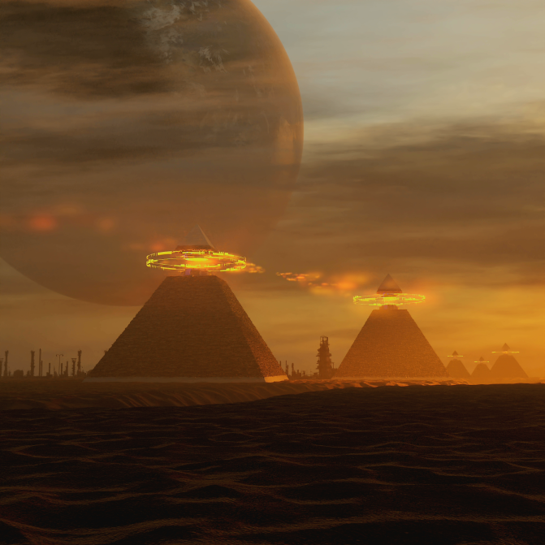

To follow the 2022 Reddit Sci Fi & Fantasy Book Bingo check [here](https://www.reddit.com/r/Fantasy/comments/ttrev1/official_rfantasy_2022_book_bingo_challenge/)

Books I've read in June 2022:

- [Pushing Ice](https://www.goodreads.com/book/show/89186.Pushing_Ice) - Alastair Reynolds
- [Diaspora](https://www.goodreads.com/book/show/156785.Diaspora) - by Greg Egan 
- [River of Stars](https://www.goodreads.com/book/show/15808474-river-of-stars) - by Guy Gavriel Kay
- [The Dark Beyond the Stars](https://www.goodreads.com/book/show/430150.The_Dark_Beyond_the_Stars) - by Frank M. Robinson

My all time favourite books:

- [Memories of Ice](https://www.goodreads.com/book/show/175983.Memories_of_Ice) - Malazan Book of the Fallen by Steven Erikson
- [The Dispossessed](https://www.goodreads.com/book/show/13651.The_Dispossessed) - by Ursula K. Le Guin 
- [The Dark Forest](https://www.goodreads.com/book/show/23168817-the-dark-forest) - Remembrance of Earth's Past by Liu Cixin 
- [Childhood's End](https://www.goodreads.com/book/show/414999.Childhood_s_End) by Arthur C. Clarke
- [The Hitchhiker's Guide to the Galaxy](https://www.goodreads.com/book/show/11.The_Hitchhiker_s_Guide_to_the_Galaxy?ac=1&from_search=true&qid=FThXJhmsxL&rank=1) by Douglas Adams

Image credit: [Eddie Mendoza](https://www.artstation.com/eddie)

